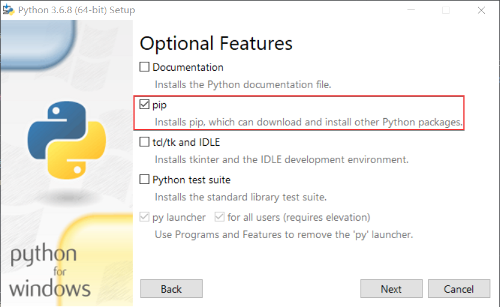

# The best way to use Python in VS Code

> VS Code is an easy-using and beautiful tool to write code, this article will tell us what's the best way to use Python in VS Code.

## Install VS Code and configure it

- Download VS Code from <https://code.visualstudio.com/>, then install it by double-clicking the setup media.

- Configure the VS Code with the following configuration file, please save the following content as settings.json.

    ```json
    {
        "workbench.colorTheme": "One Monokai",
        "files.autoSave": "onWindowChange",
        "editor.lineHeight": 28,
        "editor.minimap.enabled": false,
        "editor.wordWrap": "on",
        "workbench.statusBar.feedback.visible": false,
        "window.menuBarVisibility": "toggle"
    }
    ```

    Move the file to %APPDATA%\Code\User\settings.json, for more information, please refer to <https://code.visualstudio.com/docs/getstarted/settings>.

- Install "One Monokai" theme in VS Code, please refer to <https://code.visualstudio.com/docs/getstarted/themes>

## Install Python 

- Download Python installation media from <https://www.python.org/downloads/>, I would suggest using Python 3.6.8. Then install it on your machine by double-clicking the installation media. _Please Check the pip in the following wizard_

    

